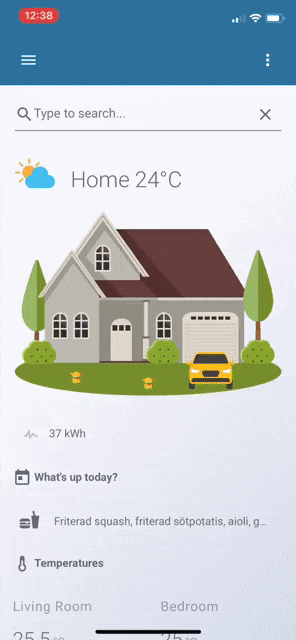

# Search Card

Quickly search for entities from a Lovelace card.



## Features

* Search for entities and display results in frontend
* Define custom actions that can be called for search input
* More to come...

## Roadmap

Some things I want to add in upcoming releases:

* Exclude domains and/or entities from results
* Button to show all results (to override "max results")

## Install

### Simple Install

1. Download `search-card.js` and copy it into `config/www/search-card` (create the `search-card` directory)

2. Add a reference to `search-card/search-card.js` inside your `ui-lovelace.yaml`

  ```yaml
  resources:
    - url: /local/search-card/search-card.js?v=0
      type: module
  ```

### Git Install

1. Clone this repository into your `www`-directory: `git clone https://github.com/postlund/search-card.git`

2. Add a reference to `search-card/search-card.js` inside your `ui-lovelace.yaml`

  ```yaml
  resources:
    - url: /local/search-card/search-card.js?v=0
      type: module
  ```

## HACS

Look for `Search Card` in the store.

## Updating

If you...

* manually copied the files, just download the latest files and overwrite what you already have
* cloned the repository from Github, just do `git pull` to update

... and increase `?v=X` to `?vX+1`.

## Using the card

### Options

| Name | Type | Default | Description |
|------|------|---------|-------------|
| max_results | integer | 10 | Max results to show by default
| actions | Object | optional | Custom defined actions

### Actions

You can define custom actions that will call a service (if it exists) with the input. Matching is done via regular expressions and {1}, {2}, {3}, etc. will be replaced by the corresponding group. See example below for inspiration.

### Example

  ```yaml
  - type: custom:search-card
    max_results: 10
      - matches: '^toggle (.+\..+)'
        name: 'Toggle {1}'
        service: homeassistant.toggle
        service_data:
        entity_id: {1}
  ```

## Issues and imitations

This is still an early version and may contain bugs. If you find any problems, please write an issue.

## Getting errors?

Clear the browser cache, restart Home Assistant and make sure the configuration is correct.

If you believe you have found an error, please write an issue.